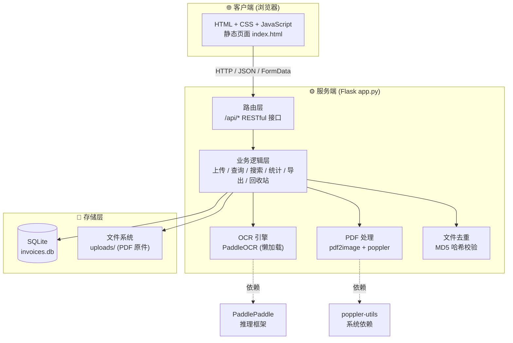
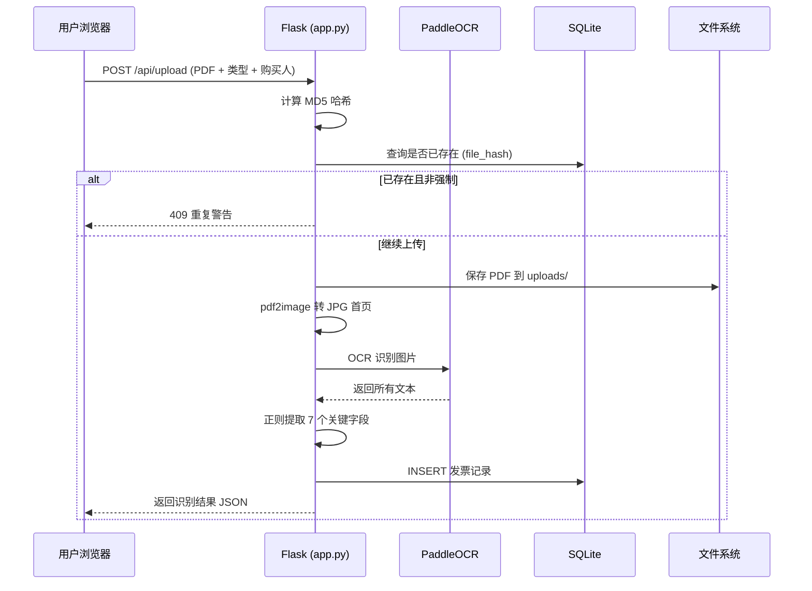

# 发票管理系统 (Invoice Management System)

> 基于 PaddleOCR 的智能发票管理工具，支持 PDF 发票自动识别、归档、检索、导出与回收站管理。

## 目录

- [项目简介](#项目简介)
- [架构图](#架构图)
- [技术栈](#技术栈)
- [功能介绍](#功能介绍)
- [功能截图 / 项目截图](#功能截图--项目截图)
- [部署方法](#部署方法)
- [使用说明](#使用说明)
- [API 接口](#api-接口)
- [目录结构](#目录结构)
- [常见问题](#常见问题)

---

## 项目简介

**发票管理系统** 是一套面向个人与小型团队的轻量级发票数字化管理解决方案。
用户只需上传 PDF 格式的发票文件，系统便会通过 **PaddleOCR** 自动识别发票上的关键字段（发票号码、开票日期、价税合计、销售方、开户行、银行账号等），并将结果结构化存储到本地 SQLite 数据库中，方便后续查询、统计、导出 Excel 以及 PDF 原件下载。

系统采用前后端一体的 Flask 单应用架构，部署简单、零外部依赖（除 OCR 模型外），适合在内网或个人服务器上快速搭建使用。

### 核心价值

- **自动化**：告别手工录入，OCR 一键提取发票关键信息
- **结构化**：所有发票字段入库存储，支持排序、搜索、统计
- **可追溯**：删除的发票进入回收站，30 天内可恢复
- **可导出**：一键导出 Excel 表格，方便财务对账
- **零成本**：基于开源技术栈，本地部署无需任何付费服务

---

## 架构图

系统采用经典的 **客户端 → Flask 应用 → SQLite 数据库** 三层结构，OCR 引擎在应用进程内懒加载。



### 数据流：上传一张发票



---

## 技术栈

| 层级 | 技术 | 版本要求 | 用途 |
|------|------|----------|------|
| **后端框架** | Flask | ≥ 3.0.0 | Web 框架，提供 RESTful API |
| **跨域支持** | Flask-CORS | ≥ 4.0.0 | 跨域资源共享 |
| **Wsgi 工具** | Werkzeug | ≥ 3.0.1 | 文件名安全处理 |
| **OCR 引擎** | PaddleOCR | ≥ 2.7.0 | 中文发票文字识别 |
| **深度学习框架** | PaddlePaddle | ≥ 2.6.2 | OCR 模型推理 |
| **图像处理** | Pillow | ≥ 10.1.0 | PDF 转图片处理 |
| **PDF 转图片** | pdf2image | ≥ 1.16.3 | PDF 首页转 JPG |
| **PDF 渲染依赖** | poppler-utils | 系统包 | pdf2image 的底层依赖 |
| **数据库** | SQLite | Python 内置 | 轻量级结构化存储 |
| **数据处理** | pandas | - | 导出 Excel |
| **Excel 导出** | openpyxl | - | xlsx 文件写入 |
| **前端** | HTML / CSS / JavaScript | 原生 | 无框架，零构建 |
| **开发语言** | Python | ≥ 3.8 | 后端实现 |

---

## 功能介绍

### 1. 发票上传与自动识别

- 支持 **自费** 与 **对公** 两种发票类型分类
- 上传 PDF 后，系统自动调用 OCR 提取以下 7 个关键字段：
  - 发票号码（8-20 位数字）
  - 开票日期（支持 `YYYY年MM月DD日` 与 `YYYYMMDD` 两种格式）
  - 价税合计 / 总金额
  - 发票内容（如 `*生物化学制品*试剂`）
  - 销售方名称
  - 开户银行名称
  - 银行账号
- **文件去重**：基于 MD5 哈希校验，避免重复上传同一发票
- **号码去重**：检测到相同发票号码时给出警告，可强制覆盖上传

### 2. 发票查看与排序

- 按类型（自费 / 对公）分类查看发票列表
- 支持按以下字段升序/降序排序：
  - 开票日期
  - 上传时间
  - 发票号码
  - 购买人姓名
  - 总金额（按数值而非字符串排序）
- 顶部汇总栏实时显示发票数量与金额合计

### 3. 批量操作

- 复选框选择多条发票
- 一键 **全选 / 取消全选**
- 批量 **删除**（移入回收站）
- 批量 **下载** PDF 原件
- 批量 **修改** 购买人 / 类型

### 4. 搜索与筛选

支持多维度组合查询：

- 关键词模糊搜索（发票号码、购买人、销售方、内容）
- 按类型筛选
- 按开票日期区间筛选
- 按金额区间筛选（最小/最大金额）

### 5. 统计分析

提供发票统计数据接口：

- 总数、总金额、平均金额、最大/最小金额
- 按类型分组统计
- 按月份统计（最近 12 个月）
- 回收站剩余数量

### 6. 导出 Excel

- 一键将指定类型的所有发票导出为 `.xlsx` 文件
- 字段自动汉化（如 `invoice_number` → `发票号码`）
- 文件名格式：`{type}_invoices_{YYYYMMDD}.xlsx`

### 7. 回收站

- 删除的发票进入回收站，保留 30 天
- 支持 **恢复** 到主表
- 支持 **永久删除**（同时删除 PDF 原件）
- 支持 **清空回收站**（按类型或全部）
- 超过 30 天的记录自动清理

### 8. 编辑发票

- 单条发票信息可手动编辑修正
- 字段级更新，自动记录 `updated_at` 时间戳

### 9. 健康检查

- 提供 `/api/health` 接口用于监控
- 返回数据库连接状态与发票总数

---

## 功能截图 / 项目截图

> 以下截图展示了系统的实际运行效果。请将截图文件放置在 `docs/images/` 目录下。

### 主界面


*主菜单：上传发票信息 / 查看发票信息 / 回收站*

### 上传发票


*选择类型 → 上传 PDF → 填写购买人 → 自动 OCR 识别*

### 发票列表


*支持排序、复选、批量操作、汇总统计*

### 搜索与筛选


*按关键词、类型、日期、金额多维度组合查询*

### 回收站


*支持恢复、永久删除、清空*

> 📌 **截图说明**：如需补充截图，请按以下步骤操作：
> 1. 启动应用：`python app.py`
> 2. 浏览器访问 `http://localhost:5000`
> 3. 对各个功能页面截图并保存到 `docs/images/` 目录
> 4. 文件名建议：`main.png`、`upload.png`、`list.png`、`search.png`、`recycle.png`

---

## 部署方法

### 方式一：本地部署（推荐快速体验）

#### 1. 环境要求

- **Python** ≥ 3.8
- **系统依赖**：poppler-utils（PDF 渲染）
- **磁盘空间**：≥ 2 GB（PaddleOCR 模型文件较大）
- **内存**：建议 ≥ 2 GB

#### 2. 安装系统依赖

**Ubuntu / Debian：**

```bash
sudo apt-get update
sudo apt-get install -y poppler-utils
```

**CentOS / RHEL：**

```bash
sudo yum install -y poppler-utils
```

**macOS（Homebrew）：**

```bash
brew install poppler
```

**Windows：**

下载 [poppler for Windows](https://github.com/oschwartz10612/poppler-windows/releases)，解压后将 `bin` 目录添加到系统 `PATH`。

#### 3. 克隆项目

```bash
git clone <仓库地址>
cd invoice-management-system
```

#### 4. 创建虚拟环境（推荐）

```bash
python -m venv venv

# Linux / macOS
source venv/bin/activate

# Windows
venv\Scripts\activate
```

#### 5. 安装 Python 依赖

```bash
pip install -r requirements.txt
```

> ⚠️ 首次安装 PaddlePaddle 体积较大（约 500MB+），请耐心等待。
> 如安装失败，可参考 [PaddlePaddle 官方安装指南](https://www.paddlepaddle.org.cn/install/quick) 选择适配版本。

#### 6. 初始化数据库

数据库会在首次启动应用时自动创建，无需手动初始化。

#### 7. 启动应用

```bash
python app.py
```

应用启动后访问：**http://localhost:5000**

#### 8. 开发模式（可选）

```bash
export FLASK_DEBUG=true
python app.py
```

#### 9. 预加载 OCR（可选）

首次 OCR 识别需要下载模型并初始化，耗时较长。如希望启动时即完成加载，可设置环境变量：

```bash
export PRELOAD_OCR=true
python app.py
```

---

### 方式二：Docker 部署（推荐生产环境）

#### 1. 构建 Docker 镜像

创建 `Dockerfile`：

```dockerfile
FROM python:3.10-slim

# 安装系统依赖
RUN apt-get update && apt-get install -y \
    poppler-utils \
    libglib2.0-0 \
    libsm6 \
    libxext6 \
    libxrender-dev \
    && rm -rf /var/lib/apt/lists/*

WORKDIR /app

COPY requirements.txt .
RUN pip install --no-cache-dir -r requirements.txt

COPY . .

# 创建上传目录
RUN mkdir -p uploads

EXPOSE 5000

ENV HOST=0.0.0.0
ENV PORT=5000

CMD ["python", "app.py"]
```

#### 2. 构建与运行

```bash
# 构建镜像
docker build -t invoice-management-system .

# 运行容器
docker run -d \
  --name invoice-app \
  -p 5000:5000 \
  -v $(pwd)/uploads:/app/uploads \
  -v $(pwd)/invoices.db:/app/invoices.db \
  -v $(pwd)/app.log:/app/app.log \
  --restart unless-stopped \
  invoice-management-system
```

#### 3. 访问应用

浏览器打开：**http://服务器IP:5000**

---

### 方式三：生产环境部署（Gunicorn）

```bash
# 安装 Gunicorn
pip install gunicorn

# 启动（4 个 worker）
gunicorn -w 4 -b 0.0.0.0:5000 app:app

# 配合 Nginx 反向代理（推荐）
```

**Nginx 配置示例：**

```nginx
server {
    listen 80;
    server_name your-domain.com;

    client_max_body_size 16M;

    location / {
        proxy_pass http://127.0.0.1:5000;
        proxy_set_header Host $host;
        proxy_set_header X-Real-IP $remote_addr;
        proxy_set_header X-Forwarded-For $proxy_add_x_forwarded_for;
    }
}
```

---

### 环境变量配置

| 变量名 | 默认值 | 说明 |
|--------|--------|------|
| `HOST` | `0.0.0.0` | 监听地址 |
| `PORT` | `5000` | 监听端口 |
| `FLASK_DEBUG` | `false` | 是否开启 Flask 调试模式 |
| `PRELOAD_OCR` | `false` | 是否在启动时预加载 OCR 引擎 |

---

## 使用说明

### 1. 上传发票

1. 在主菜单点击 **「上传发票信息」**
2. 选择发票类型（**自费** 或 **对公**）
3. 点击 **选择文件** 上传 PDF 格式发票
4. 填写购买人姓名（自费请填写自己的名字）
5. 点击 **上传**，系统自动 OCR 识别并展示结果
6. 若提示重复，可点击 **强制上传** 继续提交

### 2. 查看发票

1. 在主菜单点击 **「查看发票信息」**
2. 选择类型（**自费** 或 **对公**）
3. 查看发票列表，点击表头可排序
4. 通过复选框选择需要操作的发票
5. 可执行 **全选**、**删除选中**、**下载 PDF**、**导出 Excel**

### 3. 搜索发票

通过 `/api/search` 接口支持：

- 关键词模糊搜索
- 类型筛选
- 日期区间
- 金额区间

### 4. 回收站

1. 在主菜单点击 **「回收站」**
2. 选择类型
3. 查看已删除的发票
4. 可执行 **恢复**、**永久删除**、**清空回收站**
5. 超过 30 天的记录会被自动清除

---

## API 接口

| 方法 | 路径 | 功能 |
|------|------|------|
| `GET` | `/` | 加载前端页面 |
| `POST` | `/api/upload` | 上传发票（自动 OCR） |
| `GET` | `/api/invoices/<type>` | 按类型获取发票列表 |
| `GET` | `/api/invoices/<id>` | 获取单条发票详情 |
| `PUT` | `/api/invoices/<id>` | 更新发票信息 |
| `POST` | `/api/invoices/delete` | 批量删除发票（移入回收站） |
| `POST` | `/api/batch-update` | 批量更新发票 |
| `GET` | `/api/search` | 多条件搜索发票 |
| `GET` | `/api/statistics` | 获取统计数据 |
| `GET` | `/api/export/<type>` | 导出 Excel |
| `GET` | `/api/download/<filename>` | 下载 PDF 原件 |
| `GET` | `/api/recycle-bin/<type>` | 获取回收站列表 |
| `POST` | `/api/recycle-bin/restore` | 从回收站恢复 |
| `POST` | `/api/recycle-bin/permanent-delete` | 永久删除 |
| `POST` | `/api/recycle-bin/empty` | 清空回收站 |
| `GET` | `/api/health` | 健康检查 |

---

## 目录结构

```
.
├── app.py                 # Flask 主应用（路由 + 业务逻辑 + OCR）
├── requirements.txt       # Python 依赖清单
├── README.md              # 项目说明文档
├── .gitignore             # Git 忽略规则
├── static/                # 前端静态资源
│   └── index.html         # 单页应用入口
├── uploads/               # PDF 发票原件存储（运行时生成）
├── invoices.db            # SQLite 数据库（运行时生成）
├── app.log                # 应用日志（运行时生成）
└── docs/                  # 项目文档与截图
    └── images/            # README 截图存放位置
```

---

## 常见问题

### Q1：首次上传发票很慢？

A：PaddleOCR 首次运行需要下载预训练模型（约 100MB+），并完成引擎初始化，耗时 30 秒至 2 分钟属正常现象。后续上传会显著加快。如希望启动时即加载，可设置环境变量 `PRELOAD_OCR=true`。

### Q2：OCR 识别准确率不高？

A：识别效果受发票清晰度、版式、扫描质量影响。对于识别错误的字段，可通过 **编辑** 功能手动修正。系统采用正则匹配关键字段，针对标准增值税发票版式优化。

### Q3：上传提示「文件太大」？

A：系统限制单文件最大 16MB。如需调整，修改 `app.py` 中的 `MAX_CONTENT_LENGTH`：

```python
app.config['MAX_CONTENT_LENGTH'] = 32 * 1024 * 1024  # 32MB
```

### Q4：PDF 转图片失败？

A：请确认系统已安装 `poppler-utils`，可通过 `pdftoppm -v` 命令验证。

### Q5：数据库文件在哪？

A：`invoices.db` 位于项目根目录，随项目运行自动创建。备份时直接复制此文件即可。

### Q6：如何备份数据？

A：备份以下两项即可：

1. `invoices.db` —— 数据库文件
2. `uploads/` 目录 —— PDF 发票原件

### Q7：支持哪些发票类型？

A：当前针对中国增值税普通/专用发票的版式优化，支持 PDF 格式。其他格式（如图片、OFD）暂不支持。

---

## License

本项目仅供学习与内部使用，如需商用请遵守 PaddleOCR 等第三方库的开源协议。
